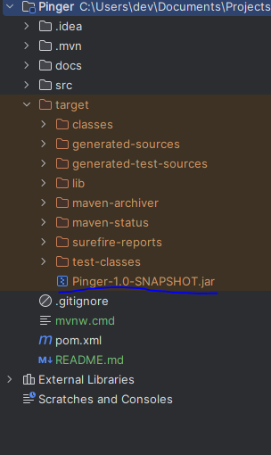
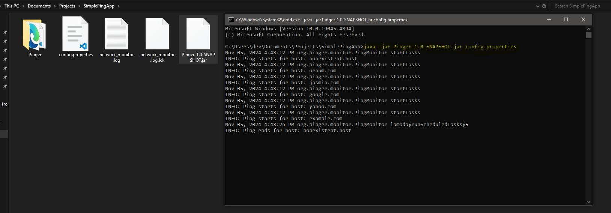

# JavaSimplePingApp - Pinger

This is the source repo of `Pinger` app. A concurrent monitoring tool built using core java. It can be used to check the user connections - status, time etc. for given host(s) periodically. <br>
This README provides steps to build and run the application and more.

## Prerequisites

- Java 8 or higher - this project was built using java 8
- Maven 3.9.9 - can use enclosed maven wrapper by changing maven home settings of IDE.
- IDE similar to IntelliJ to explore codebase

## Requirements

Please refer the pdf in docs folder for requirements:
[JavaSimplePingAppRequirements.pdf](docs/JavaSimplePingApp.pdf) <br>

Note: `Pinger` is runnable within expectations on Windows.

## Build and Run

```bash
./mvnw.cmd clean install
```
or, if maven installed on local system, please open cmd, navigate to `Pinger` folder and run command:

```bash
mvn clean install
```

Before running the app, we require a `config.properties` file with all required configurations, find a sample [here](docs/sample-config.properties). <br>
By default, `Pinger` looks for `config.properties` file one directory above the project root, weather running from IDE or as a JAR without arguments.

Note: Can also `build and run` the whole project directly from IDE like IntelliJ. <br>

**To Run `Pinger` as executable JAR from CMD:**

After successful maven build, an executable jar will be created in `target` folder: <br>

 <br>

Which can be executed using:

```bash
java -jar Pinger-1.0-SNAPSHOT.jar config.properties
```
Note: Please provide full path to `config.properties` file as parameter in the above command, sample run snapshot:



A log file will be created, if not present, at the given path in `config.properties` file. We can find the relevant logs of network monitoring there. <br>
If any networking error occur (as per the requirements) while pinging the host(s), a Report will be sent to the URL configured in `config.properties` file.

To stop the app, press `Ctrl+C`, it may take a minute to stop if any child process is running (Shutdown hook gives a minute to any running threads to exit gracefully). <br>
To stop immediately, press `Ctrl+C` twice.

## Author
[Shreepal aka elaserph](https://www.linkedin.com/in/elaserph)


